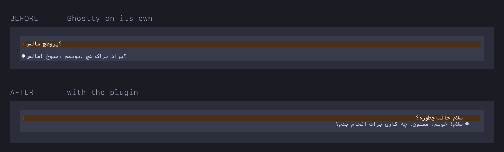

# rtl-text

A [Claude Code](https://claude.com/claude-code) mod that makes Persian, Arabic and Hebrew
readable in the terminal transcript.

Most terminals have no UAX #9 bidi and no Arabic shaping, so Persian arrives reversed and with
its letters unjoined. This mod hooks the transcript's render events, runs each line through
`fribidi`, and draws the result: letters joined, order right-to-left, RTL paragraphs flush right.



> **Claude Code mods are early access and off by default.** This one does nothing at all until
> you set `CLAUDE_CODE_ENABLE_FUNCTION_HOOKS=1` on a recent enough Claude Code.
> See [Requirements](#requirements).

It shapes what Claude Code prints. It cannot fix what you type into the prompt box; see
[Limits](#limits).

## Requirements

**1. fribidi**

```bash
brew install fribidi        # macOS
apt install fribidi         # Debian/Ubuntu
```

**2. A Claude Code new enough to carry the function-hooks runtime.**

```bash
claude --version
```

Mods are an early-access feature. They are not in the public changelog and not in the official
docs, so there is no published "available from" version to point at. What is known: 2.1.260 is the
earliest build [reported](https://claudefa.st/blog/tools/hooks/function-hooks) to carry the
runtime, and this mod is tested on 2.1.271 through 2.1.273. If you are on something older and the
mod does nothing, update before debugging anything else.

Because the feature is early access, the plugin API can change between releases without notice, so
a Claude Code update may break this mod until it is rebuilt. That warning is Anthropic's own, from
the generated type declarations.

**3. Function hooks switched on.** The feature is gated behind an environment variable even on a
build that has it. Without it the plugin installs, loads and silently does nothing, which is the
single most common reason this mod appears not to work.

The durable way is `~/.claude/settings.json`, which applies to every session however you start it:

```json
{
  "env": {
    "CLAUDE_CODE_ENABLE_FUNCTION_HOOKS": "1"
  }
}
```

Or export it in your shell (`~/.zshrc`, `~/.bashrc`) if you only ever launch Claude Code from
a terminal:

```bash
export CLAUDE_CODE_ENABLE_FUNCTION_HOOKS=1
```

**4. A monospace font covering the Arabic Presentation Forms block (U+FB50-U+FEFF)**, which is
what this mod emits. Monospace matters: a proportional Persian face forced into a terminal's cell
grid pulls the letters of a word apart, where a monospace face has its joined forms drawn to meet
at the cell edges.

[Vazir Code](https://github.com/rastikerdar/vazir-code-font) works (the "Vazir Code Hack" variant
pairs it with Hack for the Latin glyphs). Note the project is discontinued, though the released
fonts are fine. It has one gap that matters: no U+FEF5-U+FEFC, the eight lam-alef ligature forms
(the لا in سلام). Fill just those from [Vazirmatn](https://github.com/rastikerdar/vazirmatn),
which you will need installed as well. In Ghostty:

```
font-family = "JetBrains Mono"
font-family = "Vazir Code Hack"
font-codepoint-map = U+FEF5-U+FEFC=Vazirmatn
```

Do **not** add a proportional face like Vazirmatn as a plain `font-family` fallback. It wins the
Latin glyphs too and spoils your English text.

## Terminal support

The mod itself is terminal-agnostic: it asks Claude Code for the `terminal` surface and nothing
in it knows which terminal you run. What decides whether it helps or hurts is whether your
terminal does its own bidi.

This mod emits text **already reordered into visual order and already converted to presentation
forms**. Those characters still carry a strong RTL bidi class, so a terminal that runs its own
UAX #9 pass will reorder them a second time and put you back where you started.

| Terminal | Use this mod? | |
|---|---|---|
| **Ghostty** | **Yes** — tested | No bidi shipped; [#1442](https://github.com/ghostty-org/ghostty/issues/1442) open |
| kitty | Expected yes | [#2109](https://github.com/kovidgoyal/kitty/issues/2109) open since 2019 |
| Alacritty | Expected yes | [#663](https://github.com/alacritty/alacritty/issues/663) open since 2017 |
| foot | Expected yes | [#756](https://codeberg.org/dnkl/foot/issues/756), declined by the maintainer |
| Windows Terminal | Expected yes | [#538](https://github.com/microsoft/terminal/issues/538) open since 2019 |
| VS Code terminal (xterm.js) | Expected yes | [vscode#271615](https://github.com/microsoft/vscode/issues/271615) |
| iTerm2 | Only with its own RTL **off** | 3.6+ has experimental RTL under Settings → General → Experimental; off by default |
| WezTerm | Only with `bidi_enabled = false` | That is the default |
| **macOS Terminal.app** | **No** | Native bidi via CoreText; would double-reverse |
| **GNOME Terminal / VTE** | **No** | Bidi since VTE 0.58 |
| **Konsole** | **No** | [Bug 403729](https://bugs.kde.org/show_bug.cgi?id=403729) resolved fixed |
| **mlterm** | **No** | Bidi when built `--enable-fribidi`, as most packages are |

Only the Ghostty row is tested. Everything else is read off each project's own issue tracker, so
treat it as a strong prior rather than a promise. If you try one, a PR correcting the row is
welcome.

If your terminal is in the bottom group, you do not need this mod. Its rendering is already
better than what this mod can offer, since it works on logical text and can handle the composer too.

## Install

```bash
claude plugin marketplace add aliir74/claude-code-rtl
claude plugin install rtl-text@claude-code-rtl
```

Or run it straight from a clone, without installing:

```bash
CLAUDE_CODE_ENABLE_FUNCTION_HOOKS=1 claude --plugin-dir /path/to/claude-code-rtl
```

Installing writes the `enabledPlugins` entry itself, at user scope, so it is on in every project.
Later updates:

```bash
claude plugin update rtl-text
```

Remember requirement 3: without `CLAUDE_CODE_ENABLE_FUNCTION_HOOKS=1` the plugin installs
successfully and then does nothing.

## What it covers

| Component | Shaped |
|---|---|
| `AssistantMessage` | yes, as markdown |
| `UserMessage` | yes, as markdown, handed back to the engine so it keeps its background band |
| `CommandOutput` | yes, as plain text |
| `ToolResult` (Bash only) | yes, as plain text |

## Limits

**The composer is not covered.** Typing Persian into the prompt box is still broken, and no mod
can fix it: the input is not a `RenderComponent`, and `ui.input` fires only for `Input` elements a
render hook itself drew, never for Claude Code's own composer. Only your terminal gaining real
bidi fixes that. For Ghostty that is [PR #14142](https://github.com/ghostty-org/ghostty/pull/14142),
not merged as of September 2026.

**Copying shaped text gives you presentation forms.** What is on screen is what gets yanked, so
text copied out of the transcript is in visual order and will not paste cleanly back into a
logical-order editor.

Two things it deliberately leaves alone. A code block, an inline `` `code` `` span and a URL are
passed through untouched, so nothing reorders your commands. A Bash result whose output was too
large and got persisted to a file is left to the engine, because redrawing `stdout` would present
a truncated view as if it were the whole thing.

## Options

Set them in the plugin's config. Every one is optional and clamped in code, so a bad value
degrades rather than failing the load.

| Option | Default | Meaning |
|---|---|---|
| `alignment` | `auto` | `auto` right-aligns only paragraphs whose own base direction is RTL; `left` shapes without padding; `right` always right-aligns |
| `fribidiPath` | `fribidi` | Path to the binary |
| `margin` | `4` | Cells held back from `viewport.columns` before wrapping. Keep it at 1 or more: it is the slack that stops `wrap: 'truncate-end'` clipping the start of a right-aligned line if the cell measure is ever off by one |
| `cacheSize` | `256` | Shaped messages kept in the LRU |
| `timeoutMs` | `2000` | How long a `fribidi` call may take before the row falls back to the engine's own drawing |
| `replyBullet` | `⏺` | Marker on the opening line of a reply. Drawing our own tree replaces the engine's whole row, marker included, so the mod redraws it, on the right edge for RTL where the sentence starts; an empty string leaves it off |

## Troubleshooting

**Nothing changes at all.** The mod is failing silently by design: every hook falls back to the
engine's own row rather than breaking your transcript. Work down this list.

```bash
fribidi --version                              # is the binary there?
grep FUNCTION_HOOKS ~/.claude/settings.json    # is the gate set?
claude plugin list                             # is rtl-text installed and enabled?
```

If you exported the variable in your shell instead of putting it in `settings.json`, check it with
`echo $CLAUDE_CODE_ENABLE_FUNCTION_HOOKS`. A `settings.json` entry will not show up there: it is
set inside the Claude Code process, not in your shell.

If fribidi is installed somewhere unusual, set `fribidiPath` to its absolute path.

**A `no runnable fribidi after 3 tries` line in the transcript.** The mod probes for the binary on
the first render and prints why each candidate failed. The message names the real reason, which is
usually a path problem.

**Letters are joined but gappy.** That is the font, not the mod. See requirement 4 above: you are
almost certainly rendering with a proportional face.

**Persian text is reversed.** Your terminal probably has its own bidi, and it is undoing the mod's
work. Check the terminal support table.

## How it works

```
text -> hasRtl? -> split blocks -> split markdown prefix -> protect code/URLs
     -> WRAP in logical order -> one fribidi call per direction -> restore -> pad -> Text rows
```

The ordering is the whole design. Wrapping happens in **logical** order against the viewport
width, and only the finished lines are shaped. Shaping first and wrapping the visual result puts
the paragraph's opening words on the last line, which is the bug `harness/transform-real.check.ts`
exists to catch.

Two other decisions worth knowing:

- **fribidi never breaks lines for us.** Its own `--width` breaking is not word-aware and splits
  words mid-token, so every call passes `--nobreak` and the wrapping is ours.
- **Padding is ours too.** fribidi's `--width` padding is display-cell accurate, but it cannot
  express a per-line `auto` alignment, so `cellWidth` does it. That makes `cellWidth` load-bearing,
  which is why the harness checks it against fribidi's own padding as an independent oracle.

One `fribidi` subprocess handles a whole message per base direction, never one per line, and the
result is cached by `(markdown, width, text)` because render hooks re-run on every redraw and
resize.

## Development

```
.claude-plugin/plugin.json   manifest and userConfig
.claude-plugin/marketplace.json
hooks/                       the mod; no npm dependencies, no Node imports
  register.ts                the four ui.render hooks and the engine adapter
  transform.ts               the pipeline
  segment.ts                 blocks, markdown prefixes, inline protection, tables
  wrap.ts  cell-width.ts  align.ts  lru-cache.ts  rtl-detect.ts  fribidi-args.ts
  render-tree.ts             lines -> the surface's Box/Text/Code constructors
tests/                       run by `claude plugin test`
harness/*.check.ts           run by tsx; the only tests that touch the real binary
.claude/types/               generated by /plugin-types, do not hand-edit
docs/research/               measured findings this mod was built from
```

Four checks, because none covers another:

```bash
CLAUDE_CODE_ENABLE_FUNCTION_HOOKS=1 claude plugin test .     # hooks + pure logic, fribidi mocked
npx --yes tsx --test harness/*.check.ts                      # the real fribidi binary
CLAUDE_CODE_ENABLE_FUNCTION_HOOKS=1 claude plugin validate .  # structure: hooks, matchers, $ calls
npx --yes -p typescript@latest tsc -p tsconfig.json           # types
```

The hooks environment has no fs, network or process, so the real-binary tests cannot live under
`claude plugin test`. They are named `*.check.ts` rather than `*.test.ts` because that runner globs
the whole plugin directory and would refuse a module importing `node:child_process`.

### Notes for anyone editing this

- **Elements are never object literals.** They come from `$.ui.resolve(e)`. A `{ type: 'Box' }`
  literal typechecks fine and is then refused at runtime, and the engine quietly redraws its own
  row, which looks exactly like the mod not being installed.
- **`$` may only be passed to a function declared at the top of the file.** `claude plugin validate`
  enforces this so it can report which `$` calls a plugin makes. That is why the helpers in
  `register.ts` are top-level functions taking a `Context` rather than closures.
- **No raw NUL or private-use characters in source.** Use `String.fromCharCode`. A literal escape
  can land as a real control byte, which turns the file binary and makes `grep` silently miss it.
- **`userConfig` entries need a `title`.** The manifest schema rejects them otherwise.
- Regenerate the type contract after a Claude Code update: `claude -p '/plugin-types'`.
- **Bump the version in BOTH `plugin.json` and the `marketplace.json` entry, in sync.** The
  plugin cache is keyed on that string, so an unbumped release does not reach anyone who has
  already installed it, and a marketplace entry version overrides the manifest's if they differ.

## Status

Working, confirmed in Ghostty 1.3.2 on Claude Code 2.1.273. Persian renders joined, right-to-left
and flush right, Latin runs inside a Persian sentence keep their own direction, and code blocks
pass through.

## License

MIT
